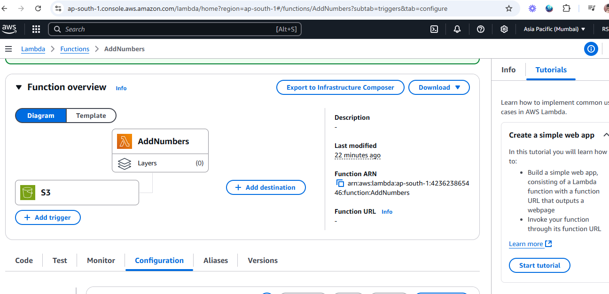

# Task 1 : Front End
# Responsive Webpage with Navbar and Dynamic Resizing
## This project implements a responsive webpage with a fixed navbar, collapsible left menu, and dynamic content resizing based on screen width. The page is designed to adapt to various screen sizes for an optimal viewing experience.

## Features
- `1. Fixed Navbar`: 
The navbar remains fixed at the top of the page, even when the user scrolls down.

- `2. Three Sections Layout`: 
Left Menu: A collapsible side menu that can be hidden or shown based on user interaction.
Main Content Area: The primary section where the main content of the page is displayed.
Right-side Panel: A secondary panel positioned to the right of the main content area.

- `3. Footer`: 
A footer is included at the bottom of the page, which will always be present.

- `4. Dynamic Page Resizing`: 
##### The page width dynamically adjusts based on the screen size using JavaScript:
- Screen width between 992px and 1600px: The page is shrunk by 90%.
- Screen width between 700px and 767px: The page is shrunk by 80%.
- Screen width between 600px and 700px: The page is shrunk by 75%.
- Screen width 600px or less: The page is shrunk to 50%.
### Setup Instructions
##### 'Prerequisites':
You need a modern browser to view the webpage.
To run this project locally, ensure you have a basic HTML, CSS, and JavaScript environment set up.
Files and Directory Structure
The project consists of the following files:

- `index.html`: The main HTML file containing the structure of the webpage.
- `style.css:`: The stylesheet that defines the layout and design.
- `script.js:`: The JavaScript file that handles the dynamic resizing of the page based on screen width.
Running the Project Locally
Clone or download this repository.

Navigate to the project directory in your terminal.

Open **index.html** in your preferred browser. The webpage should display with the described features.

###### Usage
**Fixed Navbar:** The navbar will stay at the top of the screen as you scroll down.

**Collapsible Left Menu:** The left menu can be collapsed or expanded by clicking the menu icon.

**Responsive Design:** As you resize the browser window, the JavaScript function will automatically adjust the page width according to the defined screen width ranges.


# Task 2 : Django Chat Application


## Project Overview
This project implements a chat application using Django, featuring user authentication, real-time chat functionality, and a WebSocket connection for live communication. Users can sign up, log in, and chat with each other through a user-friendly interface.

## Features
- `Sign up:`: New users can create an account by providing a username and password.
- `Login:`: Registered users can log in to access the chat application.
- `WebSocket-based Communication:`: The application uses WebSocket for real-time communication, ensuring instant message delivery.
- `Message History:`: Chat messages are stored in the database and old messages are retrieved and displayed when opening a chat.
- `User-Friendly Interface:`: The chat interface is designed for ease of use, with a clean layout and simple navigation.

## Setup Instructions
1. **Set Up Virtual Environment**:
   ```bash
   python -m venv chatenv
   
   chatenv\Scripts\activate

2. **Install Dependencies**:
   ```bash
   pip install -r requirements.txt


3. **Add Database Models**:
   ```bash
   python manage.py makemigrations
   python manage.py migrate


4. **Run python**:
   ```bash
   python manage.py runserver


5. **Open the browser and go to:**:
   ```bash
   (http://127.0.0.1:8000)

## Test the Chat Application

1. Open two browser tabs or windows and log in with two different users.
 
2. Select a user from the collapsible left menu.
   
3. Send and receive messages in real-time.  
 


